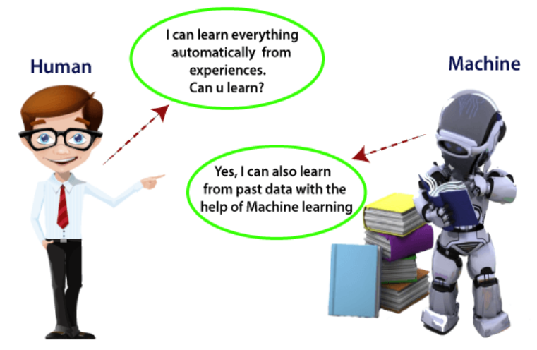
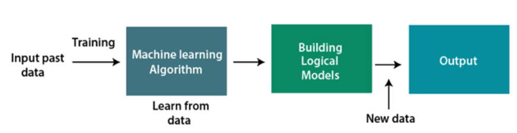
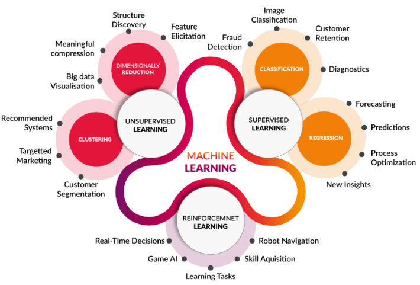
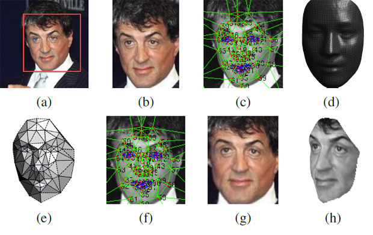
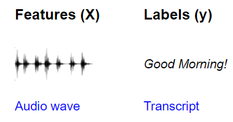
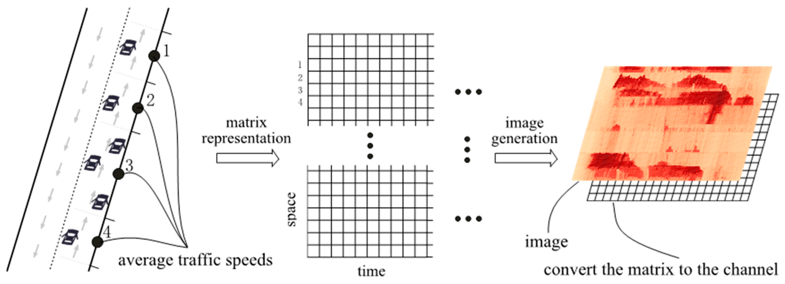
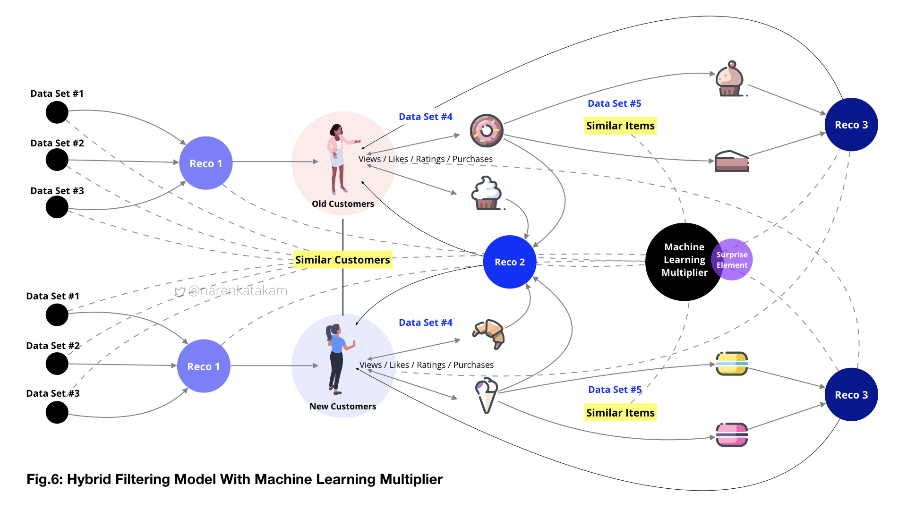
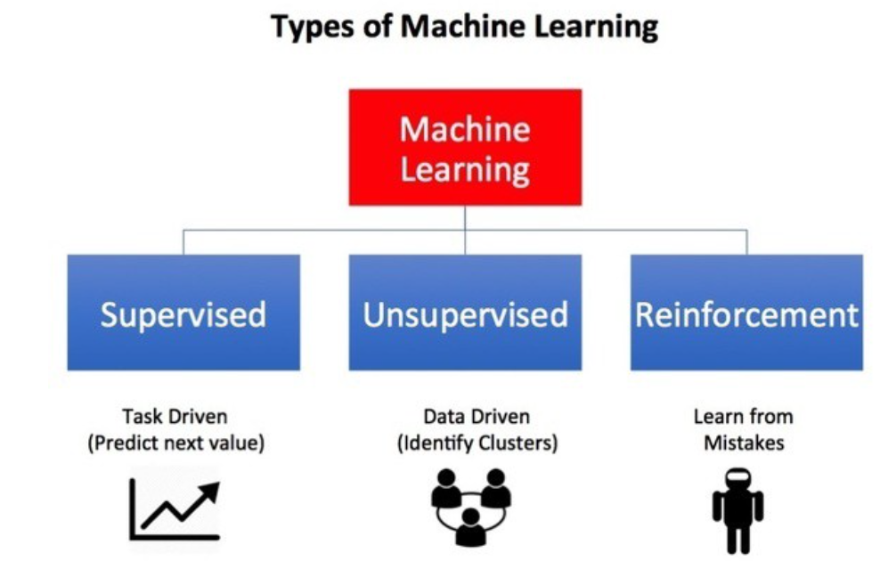
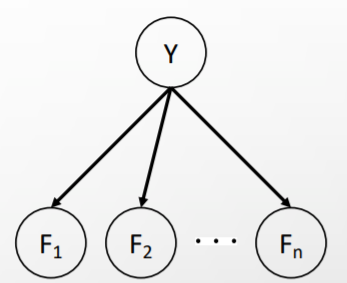

\# Table of contents 1. \[Introduction\](#Introduction) 1. \[History\](#History) 2. \[ML Applications\](#Applications) 2. \[Types of Machine Learning\](#Types) 1. \[Supervised Learning\](#Supervised) 1. \[Classification\](#Classification) 2. \[Naïve Bayes Classifier Algorithm\](#Naïve) 2. \[Unsupervised Learning\](#Unsupervised) 3. \[Bias and Variance\](#Bias) 1. \[What is Bias?\](#What) 2. \[What is variance?\](#variance) 3. \[Bias and Variance Trade-Off\](#Trade) 4. \[OverFitting and Underfitting\](#and) 1. \[So what is overfitting?\](#overfitting) 2. \[What is underfiting?\](#underfiting) 3. \[and how to prevent overfitting?\](#prevent) 5. \[Parameter Estiamtion\](#Estiamtion) 1. \[What is MLE?\](#MLE) 2. \[Waht is MAP?\](#MAP) 6. \[Handle unseen events\](#Handle) 1. \[Laplace Smoothing\](#Laplace) 2. \[Linear interpolation\](#Linear) 7. \[More about dataset\](#More) 1. \[Training Dataset\](#Training) 2. \[Validation Dataset\](#Validation) 3. \[Test Dataset\](#Test) 4. \[About the dataset split ratio\](#ratio) 8. \[Conclusion\](#Conclusion) 9. \[References\](#References)

Introduction
============

Humans are capable of learning by experiencing, but how about computers? Can they learn from past data and make correct decisions for future situations?

Machine learning techniques allow computers to automatically learn from a dataset and improve its performance from experiences and enables them to predict things in a new situation without being explicitly programmed. Machine learning algorithms bring computer science and statistics together to build mathematical models from our dataset that is known as training data and use these models for future decision. The diagram below shows the ML algorithm:

 

History
-------

The base idea behind machine learning has a long history, But the term of machine learning was first used by Arthur Samuel in 1959. Below we can see a timeline of ML in brief:

*   **1834:** Charles Babbage made the first computer that could be programmed by punched cards and all modern computers followed its logical structure.
*   **1936:** Alan Turing gave a theory about how machines can execute a set of instructions.
*   **1940:** First manually operated computer named "ENIAC" was invented.
*   **1943:** The first model of human neural network was modeled with electronic circuits.
*   **1950:** "Computer Machinery and Intelligence," was published by Alan Turing on the topic of AI with this question, "Can machines think?".
*   **1952:** Arthur Samuel created a program to play checkers for an IBM computer that could play better by playing more.
*   **1959:** Arthur Samuel first used the term of “Machine Learning” and popularized it. In this year, the first neural network was used to solve a real-world problem to remove echoes over phone lines using an adaptive filter.
*   **1974 to 1980:** These years are known as AI winter that lots of people lost their interest from AI and governmental funding reduced.
*   **1985:** A neural network was developed named NETtalk that was able to correctly pronounce 20000 words in a week.
*   **1997:** The IBM’s computer named Deep Blue won a chess game against human chess expert Garry Kasparov.
*   **2006:** Geoffrey Hinton has first used name of "deep learning" instead of neural net research.
*   **2012:** Google developed a deep neural network system to distinguish cat and human images in a YouTube video.
*   **2016:** AlphaGo won a Go game against number one and number second player of Go.

ML Applications
---------------

The machine learning concepts are growing every day and we can see its usages everywhere. Some of the real-world applications of ML are:

*   **Image recognition:**
    
    One example can be Facebook friends tagging suggestion that when we upload a photo with our Facebook friends, then we can see some labels suggestions with their names. This project is called Deep Face which uses face detection and recognition algorithms.
    

*   **Speech Recognition:**
    
    This project converts your voice to text and is also known as "Computer speech recognition." Some examples of this technology are Google assistant, Siri, Cortana, and Alexa.
    

* **Traffic prediction:**

    Google Maps gathers data from all its users and sends them to its database and uses ML algorithms and technics to provide the shortest routes with the least traffic to its users.
    

*   **Product recommendations:**
    
    Amazon and Netflix use ML for their product recommendation systems. Every time a user opens an amazon page is able to see most relevant suggestion according to its previous searches or other features that are used in dataset.
    
 

Types of Machine Learning
=========================

There are three major recognized categories for ML:

 

Supervised Learning
-------------------

In this method computer is provided by a set of labeled (tagged) data which is called training data and tries to create a mathematical model according to it and learn to approximate the exact nature of the relationship between examples and their labels. By the time this process of training finished, the supervised learning algorithm will be able to observe a new, never-before-seen example and predict a good label for it. Then we provide another set of data called sample data to test if the predictions are exact or not. One example of supervised learning is Face Recognition that we have a system that takes a photo, finds faces, and guesses who that is in the photo (suggesting a tag) is a supervised process. It has multiple layers to it, finding faces and then identifying them, but is still supervised nonetheless. The supervised algorithms are grouped in two main categories:

*   **Classification**
*   **Regression**

### Classification

In this algorithm machine learns from given training data and identifies the category of input data and classifies it into number of groups or classes. The main difference of this method and regression is that classification is a process of finding a function which helps in dividing the dataset into classes based on different parameters, but regression is a process of finding the correlations between dependent and independent variables. The classifiers can be binary that means we have only two possible outcomes, or multi-class that means we can have more than two labels or classes. In another hand we have two types of learners in a classification problem:

*   **Lazy Learners:**
    
    Lazy learning methods simply store the data and generalizing beyond these data is postponed until an explicit request is made. In this case we just store dataset without learning from it and start classifying data when test data is received. These learners find the most related data that is stored in our training dataset. First they store the training data and start the next phase when the test dataset arrives. In this method we reduce the training time but prediction time increases. Some algorithms of this method are:
    
    *   K-Nearest Neighbours algorithm
    *   Case-based reasoning
*   **Eager Learners:**
    
    Eager learning methods construct general (one-fits-all), explicit (input independent) description of the target function based on the provided training examples. In this method the learner creates a model according to the training dataset, so the training time is more than lazy learners but prediction is faster. Some algorithms of this method are:
    
    *   Decision Trees
    *   Naïve Bayes
    *   ANN

### Naïve Bayes Classifier Algorithm

Naïve Bayes algorithm is a probabilistic classifier based on Bayes theorem and is used to solve classification problems. It is called naïve because it assumes that occurrence of a certain feature is independent of the occurrence of other features. It is also called Bayes because it depends on the principle of Bayes' Theorem.

A general naïve bayes model has the form below that Y is our label variable and F is our features:

As a result of bayes net above and bayes theorem we can say that:

#### Advantages of Naïve Bayes Classifier

*   It is fast and not that much complicated.
*   It can be used for Binary as well as Multi-class Classifications.
*   It is the most popular choice for text classification problems.

#### Disadvantages of Naïve Bayes Classifier

*   Naive Bayes assumes that all features are independent or unrelated, so it cannot learn the relationship between features. It can be helpful in some cases to consider features independent, but sometimes the results are not exact.

Unsupervised Learning
---------------------

In this method our training dataset doesn’t contain labels and they have not been categorized. Instead, our algorithm would be fed a lot of data and given the tools to understand the properties of the data. In this case machine learns to group, cluster the data such that a human (or other intelligent algorithm) can come in and make sense of the newly organized data. In another word the goal of unsupervised learning is to find the underlying structure of dataset, group that data according to similarities, and represent that dataset in a compressed format. The unsupervised algorithms are grouped in two main categories:

*   **Clustering**
*   **Association**

